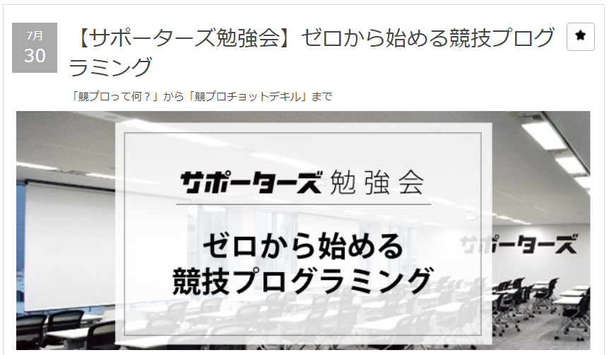
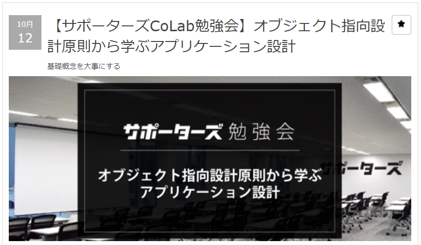
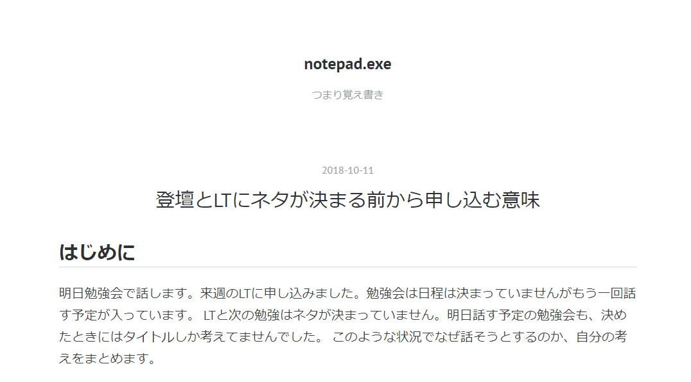

# 登壇して私が得たもの

サポーターズColab勉強会  
2018/10/19 @mosmos_21

---

## はじめに

+++

初めて登壇したとき

+++

先週登壇したやつ

+++

そして今日

+++

3回やって率直な感想

### 思ったより楽しい！

+++

### ネタはあいまいでもなんとかなる

---

## 変わったこと その2

+++

微妙にわかってなくて調べたりしたものをまとめるようになった

+++

例えばブログとかもその延長

---

## 変わったこと　その2

+++

わからなくて放置してたものが減った  
たとえば先週の設計の話とかがいい例

+++

登壇すると質問される
↓
答えられないと困るので予習する
↓
いつの間にか理解している！！

+++

むしろ勉強するために登壇するという発想  
「登壇駆動開発」

---

## 変わったこと　その3

+++

アウトプットが残るので、  
私がどういう人か外からわかるようになった

+++

よく考えたらもともとアウトプットがなかったので外から見たらなんもできない人だった

+++

アウトプットが増えるほど自分の価値が高くなっていく  
これもう最高ですね

---

# まとめ

+++

登壇すると

- 登壇思ってたより楽しい
- むしろ勉強なる
- やればやるほど自分の価値が上がる

+++

登壇続けよう！みんなもやろう！

+++

おわり